# System Overview

`IL_ideation` is a robotics design system with one user-facing product, one research experimentation environment, and one shared robotics pipeline.

```mermaid
flowchart LR
    User["User prompt"] --> Web["Next.js workspace UI"]
    Web --> API["FastAPI workspace API"]
    API --> SDK["RobotWorkspaceSDK"]
    SDK --> Designs["Design generation route"]
    Designs --> Registry["Agent loop registry"]
    Registry --> Loops["grammar_v2 or creative_qd_v2"]
    Loops --> Program["RobotDesignProgram"]
    Program --> Pipeline["Pipeline compiler and validators"]
    Pipeline --> Hitl["HITL payload"]
    Hitl --> Store["Workspace SQLite store"]
    Store --> Web
```



## The three ownership zones

| Zone | Owns | Must avoid |
| --- | --- | --- |
| Product | HTTP routes, workspace UX, persistence, design review, exports | Research-only experiment logic |
| Research | Agent loops, strategies, prompt variants, experiments, metrics | Importing `apps/` |
| Pipeline | Robot programs, IR, compilers, validators, CAD, render data | UI or route orchestration |

## The approved bridge

The only intended bridge from product into research is:

```python
from packages.research.agent_loops import run_agent_loop, list_agent_loops
```

The product backend can select and run an app-compatible loop. It should not reach into research strategies, prompt internals, experiment stores, or notebooks.

## Current generation model

The current generation model is derivation-first:

1. A loop chooses or drafts a `RobotDesignProgram`.
2. The pipeline expands the derivation into a typed graph.
3. The graph is validated for topology and open symbols.
4. The graph is lowered into component primitives.
5. A HITL payload summarizes the result for the backend.
6. The backend adapts the HITL payload into product candidates.

This is intentionally different from free-form mesh generation. The repo currently generates structured robot descriptions and conceptual render data, then compiles or lowers those descriptions into downstream artifacts.

## Product UX model

The product experience is workspace-centered:

- projects contain threads,
- threads contain user and assistant messages,
- generation creates thread artifacts,
- a selected design can be checked, compiled, exported, or used to draft simulation and policy specs.

The frontend should remain a client of backend-owned state and backend-owned generation logic.

