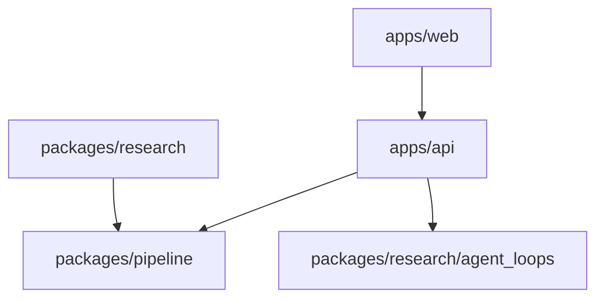

# Layer Boundaries

## Allowed dependencies



Allowed:

- `apps/web` calls `apps/api` over HTTP.
- `apps/api` imports `packages/pipeline`.
- `apps/api` imports `packages.research.agent_loops` for the registry and runner only.
- `packages/research` imports `packages/pipeline`.

Forbidden:

- `packages/research` importing `apps/api` or `apps/web`.
- product routes importing research experiment runners directly.
- frontend code encoding generation policy that belongs in `RobotWorkspaceSDK`.
- pipeline code importing FastAPI, React, Supabase clients, or frontend contracts.

## Why the boundary exists

The product layer optimizes for interactive user workflows. The research layer optimizes for iteration, measurement, reproducibility, and controlled experiments. The pipeline layer optimizes for deterministic robot representations.

Mixing these concerns makes failures hard to diagnose:

- a UI change can accidentally change research metrics,
- an experiment-only prompt can leak into production behavior,
- a pipeline schema change can silently break frontend rendering,
- a local notebook path can become a production dependency.

## Boundary checklist

Before changing a file, ask:

| Question | If yes |
| --- | --- |
| Does this change an HTTP request or response shape? | Update product route tests and frontend contract docs |
| Does this add a new generation method? | Put it under `packages/research/strategy/` or `packages/research/agent_loops/` |
| Does this change the robot representation? | Update pipeline tests and architecture handoff docs |
| Does this change how the frontend renders a candidate? | Update `apps/web/lib/types.ts` and viewer tests |
| Does this change a loop name or default loop? | Update registry tests and product loop selection behavior |

## The app-compatible agent loop contract

Product routes expect a loop to implement:

```python
loop(prompt, initial_state=None, *, config=None) -> AgentLoopResult
```

Where `AgentLoopResult` contains:

- `state`: full research/debug state,
- `hitl`: backend-facing human-in-the-loop payload.

The HITL payload is deliberately product-friendly. It is the contract that lets a research loop power the app without making the app understand every research internal.

