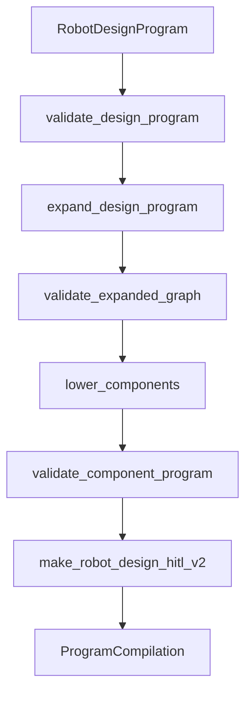

# Robot Design Program V2

The core body-generation compiler lives in:

```text
packages/pipeline/robot_program.py
```

This is one of the most important files in the repo.

## Core idea

The system does not directly hallucinate a final mesh. It creates a compact, auditable robot program:

```text
RobotDesignProgram
  -> ExpandedRobotGraph
  -> ComponentProgram
  -> RobotDesignHitlV2
```

Each step is deterministic after the program is selected.

## Main dataclasses

| Dataclass | Role |
| --- | --- |
| `RobotDesignProgram` | Selected grammar, start symbol, derivation steps, metadata |
| `DerivationStep` | One grammar rule application against a target node |
| `GrammarCatalog` | Available grammar symbols and rules |
| `GrammarRule` | Rule expansion definition |
| `ExpandedRobotGraph` | Expanded graph of generated robot nodes and edges |
| `ComponentProgram` | Lowered component-level body representation |
| `RobotDesignHitlV2` | Reviewable backend-facing payload |
| `ProgramCompilation` | Full compiler result with program, graph, components, errors, warnings |

## Compiler stages



## Program validation

`validate_design_program()` checks that the program uses known symbols, known rules, valid targets, and valid repeat settings.

This prevents a loop from returning a payload that looks plausible but cannot be expanded against the grammar catalog.

## Graph expansion

`expand_design_program()` applies derivation rules to build an `ExpandedRobotGraph`.

It handles:

- selected target nodes,
- repeated expansions,
- metadata propagation,
- edges between generated nodes,
- stable graph construction.

## Graph validation

`validate_expanded_graph()` catches topology problems such as:

- open nonterminals,
- disconnected graph regions,
- orphan limb-like structures,
- missing contact surfaces,
- invalid or inconsistent generated nodes.

This is where a body becomes more than a text description. It must pass structural checks.

## Component lowering

`lower_components()` maps graph nodes to component primitives using the component catalog.

Examples:

- body segments become capsules or connectors,
- limb links become capsules,
- joints become component joints,
- feet or contact points become contact surfaces.

The result is a lower-level body program that can be materialized or rendered more concretely.

## HITL payload

`make_robot_design_hitl_v2()` produces a human-in-the-loop payload with summary fields the backend can consume.

It can include:

- selected program,
- graph summary,
- symbol counts,
- component summary,
- compile-safe status,
- validation messages,
- candidate metadata.

The product design route reads this HITL payload to build flat frontend candidates.

## Why this file is the body-generation center

Agent loops decide what program to try. `robot_program.py` decides whether that program is structurally meaningful and how it expands into a generated body.

When debugging generated bodies, start here after confirming which loop produced the program.

