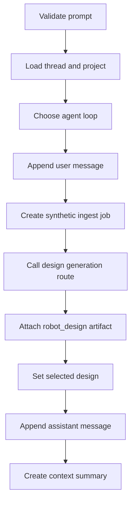

# Workspace SDK

`apps/api/workspace_sdk.py` contains `RobotWorkspaceSDK`, the backend-first orchestration surface for the workspace UI.


Keep frontend and Electron code thin. If a workflow changes project, thread, generation, simulation, or policy state, it belongs in the backend SDK or store.


## Core responsibilities

`RobotWorkspaceSDK` owns:

- project creation and listing,
- thread creation and listing,
- user and assistant message persistence,
- prompt generation orchestration,
- context summary creation,
- selected design tracking,
- simulation spec creation,
- lightweight simulation checks,
- policy spec creation.

## Generation flow

`generate_for_thread()` is the main entrypoint.

## Loop selection

The SDK chooses a loop conservatively:

1. use the requested loop if it is registered,
2. otherwise prefer `creative_qd_v2` if available,
3. otherwise fall back to `grammar_v2`.

This keeps the product path usable even if a more experimental loop is unavailable in a local checkout.

## Synthetic ingest jobs

Workspace generation does not require the user to run `/ingest` first. The SDK creates an ingest job with:

- the prompt,
- a minimal plan,
- source `none`,
- status suitable for generation.

It then calls the same design generation route used by ingest-driven flows. This avoids duplicating candidate creation logic.

## Thread artifacts

Generated designs are saved as thread artifacts with type `robot_design`. The artifact contains:

- selected candidate,
- all returned candidates,
- render payloads,
- telemetry,
- model preference,
- grammar HITL data.

Frontend panels read these artifacts rather than recomputing generation state.

## Simulation checks

`run_simulation_checks()` is intentionally lightweight. It checks whether:

- MJCF or render payload data exists,
- the candidate is marked compile-safe,
- screening scores clear the local threshold when available.

It records `full_training_started: False`. Full RL training is not hidden behind this route.

## Policy specs

`create_policy_spec()` stores a policy-training request with observation, action, reward, and safety fields. It marks the spec ready but does not run PPO or any long-running control training.

