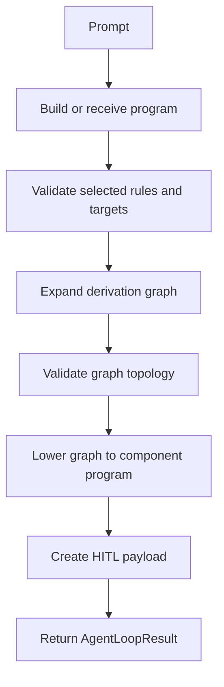

# Grammar V2 Loop

`grammar_v2` lives in:

```text
packages/research/agent_loops/grammar_v2_loop.py
```

It is the current baseline loop for robot body generation.

## What it emits

The loop emits a compact `RobotDesignProgram`, then uses the pipeline compiler to produce:

- expanded robot graph,
- validation messages,
- component program,
- HITL payload,
- debug state.

## Default grammar catalog

`build_default_grammar_catalog_v2()` defines a small derivation grammar with symbols such as:

- `S`,
- `body`,
- `body_chain`,
- `segment`,
- `body_joint`,
- `limb_mount`,
- `limb_pair`,
- `limb`,
- `upper_limb`,
- `limb_joint`,
- `lower_limb`,
- `contact_surface`.

The default rule set includes patterns for:

- worm or snake-like chained bodies,
- quadruped bodies,
- bilateral limb pairs,
- two-link limbs with contact surfaces.

## Default component catalog

`build_default_component_catalog_v2()` maps graph symbols into component primitives such as:

- connectors,
- capsules,
- joints,
- contact surfaces.

This is the bridge from grammar symbols to component-level body structure.

## Deterministic fallback

If no program-building model is configured, the loop uses a fallback program:

- prompts containing words like worm, snake, serpentine, or crawl become a chained body,
- other prompts generally become a quadruped-style program.

This fallback is deliberate. It keeps local tests and demos usable without a live LLM.

## Loop steps



## HITL content

The HITL payload can include:

- summary,
- compile-safe flag,
- graph node and edge counts,
- symbol counts,
- component summary,
- selected `RobotDesignProgram`,
- validation messages,
- candidate metadata.

The product route reads this payload to create frontend candidates.

## Why this loop matters

`grammar_v2` is the cleanest current answer to "how robot bodies are generated." It does not ask the frontend to invent geometry. It produces a structured derivation that the pipeline can expand, validate, and lower deterministically.

